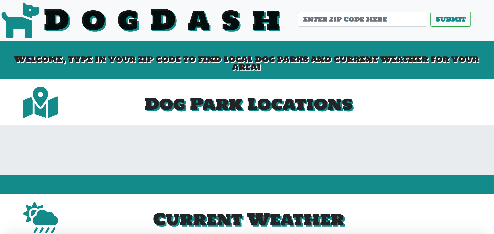

# DogDash App

### **Description:**
This is a an application that utilizes google maps and open weather map APIs, in order to retreive data and display it on the page. Users simply enter a valid zip code and upon pressing the submit button, they will be shown a list of adresses reflecting any dog park locations within the specified zip code. Users will also be shown information pertaining to current weather conditions for the specified zip code. The app includes a carousel of puppy images. The original project plan was to allow users to add dog related images of their own, but my project team was unable to complete this task due to security concerns. Another planned feature was to include a way for users to communicate with each other, but security concerns prevented us from being able to successfully do so.
 

_____

### **Using the App in google chrome**
* This application requires the installation of a chrome extension called "allow-control-allow-origin". This enables the AJAX calls to function properly. Follow the link below to install.
    * Chrome Extension Link:  (https://chrome.google.com/webstore/detail/allow-cors-access-control/lhobafahddgcelffkeicbaginigeejlf?hl=en)
 

_____

### **Demo Screenshots**
#####DogDash
* A sneak peek at the main page!

_________

### **Technologies Used**
* HTML5
* CSS
* Bootstrap
* FontAwesome
* JavaScript
* Google-maps API
* Open Weather Maps API
 

_____

### **Built With**
* Visual Studio Code
